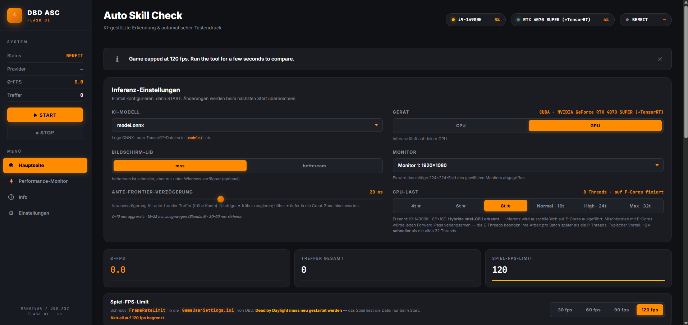
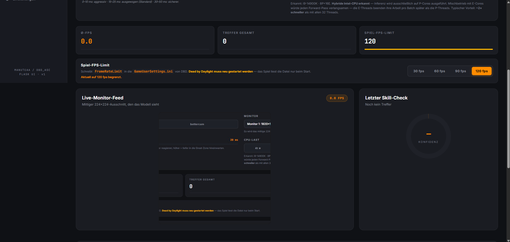
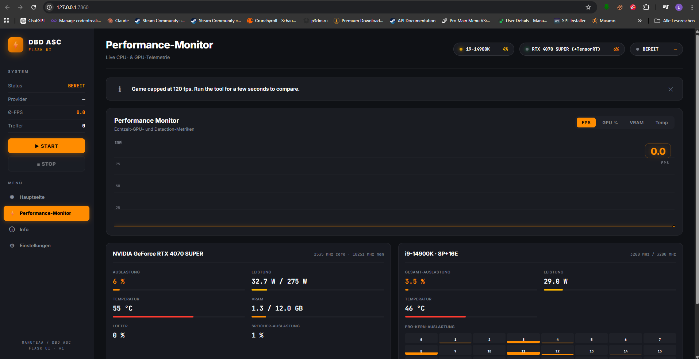
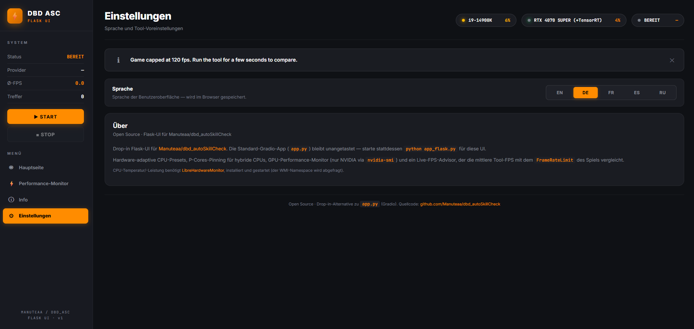
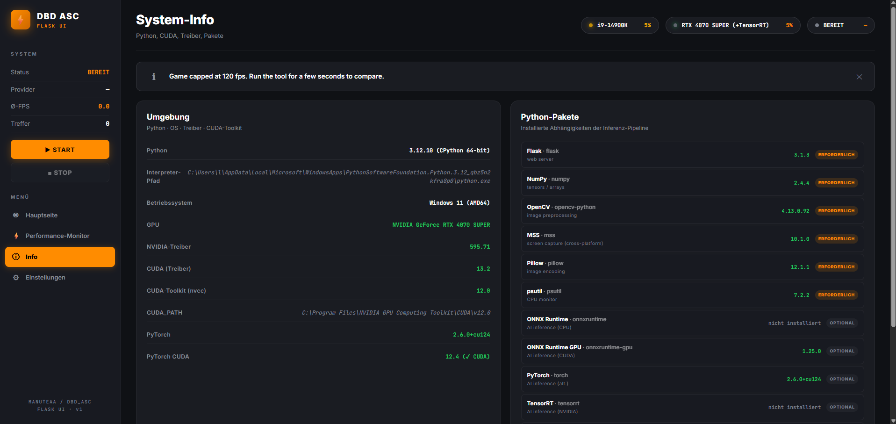

<div align="center">

# DBD Auto Skill Check

### A real-time computer-vision tool that automatically hits great skill checks in Dead by Daylight.

Built on PyTorch · MobileNet V3 · ONNX Runtime · CUDA / TensorRT


*Demo at 2× speed*

</div>

---

## Disclaimer

> **This project is intended for research and educational purposes in the field of deep learning and how computer vision AI can help in video games.**
>
> Using it may violate game rules and trigger anti-cheat detection. The author is not responsible for any consequences resulting from its use, this includes bans or any other unspecified violations. Use at your own risk. Join the [discord server](#acknowledgments) for more details about how to test it, after accepting the fair-use agreement.

---

## A note from the author of this fork

A lot of time and passion went into this fork. The original project from [Manuteaa](https://github.com/Manuteaa) is brilliant — the model, the dataset structure, the dataloader, the inference loop. What I wanted to add was a **production-grade desktop dashboard** around it: something that feels alive, tells you why your FPS dropped, shows you exactly what your CPU and GPU are doing while the model runs, and works the same way on a low-end laptop and a 14900K + 4070 SUPER. The new **Flask UI** is the result.

This is being prepared for an upstream merge — see the dedicated [Flask UI section](#flask-ui-the-new-dashboard) for what it brings. The original Gradio UI (`app.py`) remains untouched as a stable fallback.

---

## Showcase — the new Flask UI

<table>
  <tr>
    <td align="center"><br/><sub><b>Open page (top)</b> — model picker, device (CPU/GPU), screen-capture backend (MSS / BetterCam), monitor selector, anti-frontier delay, adaptive CPU workload preset.</sub></td>
  </tr>
  <tr>
    <td align="center"><br/><sub><b>Open page (bottom)</b> — live 224×224 monitor feed, last detected skill check with confidence, in-UI editable FPS cap with 30/60/90/120 presets that round-trip with <code>GameUserSettings.ini</code>.</sub></td>
  </tr>
  <tr>
    <td align="center"><br/><sub><b>Performance Monitor</b> — live CPU/GPU telemetry with switchable line chart (FPS · GPU% · VRAM · Temp), per-core load, package power & temperature.</sub></td>
  </tr>
  <tr>
    <td align="center"><br/><sub><b>Settings</b> — five-language UI (EN · DE · FR · ES · RU), persistent preference, first-run language picker, About panel.</sub></td>
  </tr>
  <tr>
    <td align="center"><br/><sub><b>System Info</b> — Python / OS / NVIDIA driver / CUDA toolkit / installed-package matrix, all live-detected.</sub></td>
  </tr>
</table>

---

<!-- TOC -->
## Table of contents

* [Features](#features)
* [Flask UI — the new dashboard](#flask-ui-the-new-dashboard)
* [Quick start](#quick-start)
  * [Python embedded app](#python-embedded-app)
  * [Build from source](#build-from-source)
  * [Running the Web UI](#running-the-web-ui)
* [Project details](#project-details)
  * [What is a skill check](#what-is-a-skill-check)
  * [Dataset](#dataset)
  * [Architecture](#architecture)
  * [Training](#training)
  * [Inference](#inference)
  * [Results](#results)
* [FAQ](#faq)
* [Acknowledgments](#acknowledgments)
<!-- TOC -->

---

## Features

| | |
|---|---|
| **Real-time detection** | Up to **120 fps** detection rate end-to-end |
| **Accuracy** | **98.7 % precision** across all 11 skill-check categories |
| **Auto-press** | Native Windows `SendInput` — no PyAutoGUI dependency |
| **GPU acceleration** | ONNX Runtime CUDA · TensorRT · DirectML (AMD) |
| **Two UIs** | Original Gradio (`app.py`) + new Flask dashboard (`app_flask.py`) |
| **Fast capture** | Optional **BetterCam** (DXGI) — ~2× faster than MSS on Windows |
| **Five languages** | EN · DE · FR · ES · RU — selected on first launch, persisted |
| **Live system monitor** | Per-core CPU load, package temp & power, GPU clocks, VRAM, fan, draw |
| **FPS advisor** | Reads in-game `GameUserSettings.ini` and warns when the tool lags the cap |

What's in the **beta V4 release** (only available in the discord server for now):
- A brand-new **AI model trained on updated data**, offering improved accuracy and supporting perks: 1, 2, 3, 4 / Decisive Strike / Oppression. Add-on: Brand New Part
- A lighter CPU-optimized version of the AI model (1.5 MB) using 8-bit integer quantization
- A GPU-optimized version of the AI model (6 MB) using CUDA or cuML
- A new user interface
- A simpler, more accessible way to enable GPU mode
- Some options to customize the AI settings, especially helpful for older hardware

---

## Flask UI — the new dashboard

`app_flask.py` is a complete, drop-in replacement for the Gradio interface. It is designed around three principles: **show the user what the tool is actually doing**, **explain why something is wrong**, and **adapt to the hardware it finds**.

### Pages

#### 1. Hauptseite (Home)
- **Adaptive CPU/GPU detection** — real core count (P+E split for hybrid Intel CPUs), real GPU name, available execution providers (CPU / CUDA / TensorRT / DirectML).
- **Monitor picker** with live preview of the 224×224 center-crop the model will see.
- **Screen-capture backend toggle**: MSS (cross-platform default) ↔ BetterCam (Windows-only, DXGI-direct, ~2× faster). MSS is kept in as a guaranteed fallback so the project still works on Linux/macOS and on Windows installs without BetterCam.
- **Game FPS-cap input** that round-trips with `GameUserSettings.ini` — the UI reads your real cap and warns if the rolling-average tool FPS falls below it (the README requires both ≥ 60 fps for reliable great-hits).
- **Toast notifications** for status, errors, and FPS warnings — no more silent failures.

#### 2. Performance Monitor
- **SUV-style switchable line chart** with four metrics: FPS · GPU % · VRAM · Temp. 60-sample rolling history, glowing orange line, current-value marker.
- **Per-core CPU bars** — live load for every logical thread (32 on a 14900K), refreshed at 600 ms via a thread-safe own-delta tracker (no `psutil.cpu_percent` race conditions).
- **CPU package telemetry** — temperature and power read directly from `LibreHardwareMonitorLib.dll` via **pythonnet**. No WMI publishing dance, no GUI needed; just install LHM and run the server elevated. Falls back to the WMI route automatically when the direct path isn't available.
- **GPU panel** — clock (core / mem), utilization, VRAM used / total, fan %, package power vs limit, temperature. Powered by `nvidia-smi`.

#### 3. Info
- **Environment matrix** — Python version & implementation, OS, NVIDIA driver, CUDA toolkit (with `CUDA_PATH`), GPU name.
- **Package matrix** — every dependency the project knows about (Flask, NumPy, OpenCV, MSS, Pillow, psutil, ONNX Runtime CPU/GPU, PyTorch, TensorRT, BetterCam, pywin32) with installed-version strings, *Required* / *Optional* badges, and a "not installed" hint when missing. Read via `importlib.metadata` so heavy modules aren't actually imported.

#### 4. Settings
- **Language picker** — EN · DE · FR · ES · RU. Persists to `localStorage`, so the choice is remembered across sessions.
- **First-run modal** — on the very first launch the UI blocks behind a language picker before doing anything else. Asked once, never again.
- **About panel** with the author/repo footer kept intact for upstream attribution.

### Why bettercam was added — and why MSS stayed

Screen capture is the hottest part of the inference loop. On Windows, **BetterCam** taps the **Desktop Duplication API (DXGI)** and pulls frames straight out of the GPU framebuffer — roughly **2× the throughput of MSS** (which goes through GDI BitBlt) at a fraction of the CPU cost. On a 14900K + 4070 SUPER it's the difference between ~120 fps and 240+ fps capture, which leaves a lot more headroom for the CNN.

But BetterCam is **Windows-only**. To keep the project usable on Linux / macOS, on Windows installs that don't have BetterCam, and as a safety net if the DXGI path ever breaks on a specific GPU driver, **MSS is kept as the default and as a permanent fallback**. The UI exposes both and lets you switch at runtime — best of both worlds.

### Backend hardening

- **Thread-safe CPU sampler** — replaced `psutil.cpu_percent(interval=None)` (which uses module-global cookies and races itself when multiple Flask threads call it) with an own-delta tracker that holds a 500 ms baseline behind a lock. Total and per-core both reflect real load now.
- **Direct DLL backend** for LibreHardwareMonitor via pythonnet — bypasses WMI publishing entirely, which is brittle and often silently broken in the LHM GUI.
- **Backend locale path** — server-side translation hooks for the FPS advisor (so warning messages appear in the user's language).

---

## Quick start

```bash
git clone https://github.com/Manuteaa/dbd_autoSkillCheck
cd dbd_autoSkillCheck
pip install -r requirements.txt
```

Then either run the original Gradio app:
```bash
python app.py
```

Or the new Flask dashboard:
```bash
python app_flask.py        # then open http://127.0.0.1:7860
```

Both UIs share the same model and the same skill-check logic. Pick whichever you prefer.

> **NVIDIA users**: install `onnxruntime-gpu` instead of `onnxruntime` for CUDA inference. See the FAQ for the GPU setup checklist. The unified `requirements.txt` deliberately leaves the ONNX runtime line commented so it doesn't clobber an existing GPU install.

> **Windows + Performance Monitor (CPU temp/power)**: install [LibreHardwareMonitor](https://github.com/LibreHardwareMonitor/LibreHardwareMonitor) (`winget install LibreHardwareMonitor.LibreHardwareMonitor`) and start `app_flask.py` as Administrator. With pythonnet present, the Flask server reads the DLL directly — no WMI publishing required.

### Python embedded app

This is the recommended method to run the AI model. You don't need to install anything, and don't need any Python knowledge.

1) Go to the [releases page](https://github.com/Manuteaa/dbd_autoSkillCheck/releases) and go to the **latest** release (at least v3.0)
2) Download `dbd_autoSkillCheck.zip` and unzip it
3) Run `run_app.bat` (double click) to start the AI model web UI. You can safely run it (ignore the Windows warning message). If you do not feel 100% comfortable with it, just read the content of the `.bat` file, copy and paste the single line in a terminal to run it manually.
4) Follow the [next instructions](#running-the-web-ui)

### Build from source

Use this method if you have some experience with Python and if you want to customize the code. This is also the only way to run the code using your GPU device (see [FAQ](#faq)).

1) Create a Python env (Python 3.12 recommended)
2) `pip install -r requirements.txt`
3) `git clone` the repo or download the source code (zip)
4) Pick a UI:
   - `python app.py` — original Gradio UI
   - `python app_flask.py` — new Flask dashboard
5) Follow the [next instructions](#running-the-web-ui)

### Running the Web UI

Once the server is running, open the local URL printed in the console (usually `http://127.0.0.1:7860`).

1) Select the trained AI model (defaults to `model.onnx` shipped with the repo)
2) Select the device. CPU is the default. GPU requires the [Build-from-source](#build-from-source) path.
3) Select your monitor. Verify the right-hand panel shows the screen you'll play on. Best results at 1920×1080.
4) Configure feature options (see the [FAQ](#faq))
5) Click **RUN** — the tool now monitors your screen and presses SPACE on every great skill check.
6) Toggle **STOP** / **RUN** at will (e.g. while in lobby).

When running, frames are sampled (224×224 center-crop) and analysed locally on your machine. When a great skill check is detected, SPACE is pressed and the loop sleeps 0.5 s to avoid double-triggering.

The right side of the UI displays:
- **AI model FPS** — frames per second the model is processing
- **Last hit frame** — the frame that triggered the SPACE press. *This may not be the frame the game registers, because the model anticipates input latency and presses slightly before the cursor enters the great area.*
- **Skill check probabilities** — softmax over the 11 categories for the current frame.

> **Both the game AND the AI model FPS must run at a minimum of 60 fps for reliable great skill checks.**

---

## Project details

### What is a skill check

A skill check is a game mechanic in Dead by Daylight that allows the player to progress faster in a specific action such as repairing generators or healing teammates. It occurs randomly and requires players to press the space bar to stop the progression of a red cursor.

Skill checks can be:
- **failed**, if the cursor misses the designated white zone
- **successful**, if the cursor lands in the white zone
- **greatly successful**, if the cursor accurately hits the white-filled zone

|     Repair-Heal skill check     |       Wiggle skill check        |       Full white skill check        |        Full black skill check         |
|:-------------------------------:|:-------------------------------:|:-----------------------------------:|:-------------------------------------:|
|  |  |  |  |

Successfully hitting a skill check increases the speed of the corresponding action; a great hit gives even more. Missing a skill check slows progression and alerts the killer with a loud sound.

### Dataset

We designed a custom dataset from in-game screen recordings and frame extraction of gameplay videos on YouTube. Each frame is center-cropped to 320×320 to save disk space.

The data is manually divided into 11 folders by:
- **Skill-check type** (repair/heal, struggle, wiggle, special variants like overcharge & merciless storm) — visuals differ enough that they need separate categories.
- **Cursor position** relative to the hit area — outside, just before, and inside.

> We experimentally found that, depending on the skill-check type, SPACE must be pressed *slightly before* the cursor reaches the great area to anticipate the game's input latency. That's why the dataset has the ante-frontier / frontier granularity.

We use random rotations, random crop-resize, and random brightness/contrast/saturation as augmentation.

A custom dataloader auto-parses the dataset folder and assigns labels by directory. A custom sampler handles class imbalance.

### Architecture

The skill-check detector is an encoder-decoder built on **MobileNet V3 Small** — chosen for its inference-speed/accuracy trade-off. We compared it to MobileNet V3 Large; the accuracy gain wasn't worth the size jump (20 MB vs 6 MB) and the slower inference.

The decoder's last layer was rewritten from 1000-class ImageNet output to an 11-class classification head.

### Training

Standard cross-entropy loss with per-category accuracy as the monitoring metric. Trained on a personal workstation and on AWS `g6.4xlarge` EC2 (~1.5× faster than local).

### Inference

The training script saves a PyTorch checkpoint; we convert it to ONNX and run it through ONNX Runtime — **1.5× to 2× faster** than the baseline PyTorch inference.

### Results

Test set: ~2000 held-out images.

| Category Index | Category description        | Mean accuracy |
|----------------|-----------------------------|---------------|
| 0              | None                        | 100.0%        |
| 1              | repair-heal (great)         | 99.5%         |
| 2              | repair-heal (ante-frontier) | 96.5%         |
| 3              | repair-heal (out)           | 98.7%         |
| 4              | full white (great)          | 100%          |
| 5              | full white (out)            | 100%          |
| 6              | full black (great)          | 100%          |
| 7              | full black (out)            | 98.9%         |
| 8              | wiggle (great)              | 93.4%         |
| 9              | wiggle (frontier)           | 100%          |
| 10             | wiggle (out)                | 98.3%         |

On a laptop, MobileNet V3 Small inference is ~10 ms/frame. End-to-end (capture + inference + key press), the loop holds **120 fps** consistently.

> The high accuracy comes from the dataset quality, the augmentation, and the architectural choice. **The RUN script hits great skill checks with high confidence.**

---

## FAQ

**What about the anti-cheat system?**
The script monitors a small crop of your main screen, processes it with an ONNX model, and presses/releases SPACE via the [Windows MSDN `SendInput`](https://learn.microsoft.com/en-us/windows/win32/inputdev/virtual-key-codes?redirectedfrom=MSDN) API at most once every 0.5 s. EAC may consider this an unfair advantage and could ban you. **Use only in private games.** For public-game guidance, join the Discord server after accepting the fair-use agreement.

**How do I run on NVIDIA (CUDA)?**
- Uninstall `onnxruntime` then install `onnxruntime-gpu`
- Match versions: see [the compatibility matrix](https://onnxruntime.ai/docs/execution-providers/CUDA-ExecutionProvider.html#requirements)
- Install [CUDA](https://developer.nvidia.com/cuda-downloads) and [cuDNN](https://developer.nvidia.com/cudnn) matching your CUDA version
- Install [PyTorch](https://pytorch.org/get-started/locally/) with CUDA compute
- Pick "GPU" in the Web UI and click RUN
- Install the latest MSVC if you hit a build error
- *Advanced*: convert the `.onnx` model to a `.trt` engine and select it with GPU mode for TensorRT speeds.

**How do I run on AMD (DirectML)?**
- `pip install torch` (CPU build is fine)
- Uninstall `onnxruntime` then install `onnxruntime-directml`
- Pick "GPU" in the Web UI and click RUN

**Why do I hit good skill checks instead of great?**
- Make sure both the game and the AI model run around 120 fps or more.
- Check your ping.
- Disable game filters / ReShade, V-Sync, and FSR.
- In the Features options, decrease the `Ante-frontier hit delay` value (closer to 0).

**How do I increase the AI-model FPS?**
- Use the *High performance* power plan in Windows.
- Run the app at a higher process priority.
- Close background apps; lower in-game graphics.
- Increase `CPU workload` in the Features options (tune to your CPU).
- Run both monitor and game at 1920×1080 @ 100% scale.
- Bump monitor refresh rate (120 Hz+).
- Switch device to GPU.
- **Use BetterCam** instead of MSS on Windows — ~2× faster capture.

**Why does the AI model hit too early and fail?**
Increase `Ante-frontier hit delay`.

**Does it work with Hyperfocus?**
Yes.

**`[ONNXRuntimeError] : 7 : INVALID_PROTOBUF` on model load?**
GitHub sometimes downloads a 0-byte `.onnx`. Re-download [`models/model.onnx`](https://github.com/Manuteaa/dbd_autoSkillCheck/blob/main/models/model.onnx) and replace the empty file.

---

## Acknowledgments

The project was made and is maintained by [Manuteaa](https://github.com/Manuteaa). If you enjoy this project, consider giving it a star — it helps others discover it and is genuinely motivating.

The Flask UI fork is maintained by [Pommes20304050](https://github.com/Pommes20304050).

Open issues for questions, suggestions, or bugs. The Discord server lives at https://discord.gg/3mewehHHpZ.

- Big thanks to [hemlock12](https://github.com/hemlock12) for help with data collection.
- Thanks to Aaron for the big help with the Discord server.
